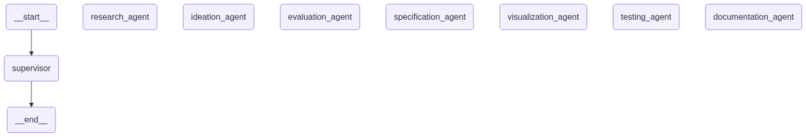

# A Virtual AI Laboratory for R&D: Leveraging Multi-Agent Systems and Human Collaboration

[](https://python.org)
[](https://github.com/langchain-ai/langgraph)
[](https://github.com/langchain-ai/langchain)
[](LICENSE)
[](https://www.entrepreneurship.dtu.dk/)

> **Master's Thesis Project** | DTU Entrepreneurship | July 2025  
> **Author:** Krzysztof Mateusz Wozniak  
> **Supervisor:** Michael Kai Petersen, Associate Professor, DTU

## 🎓 Academic Overview

This repository contains the complete implementation of my master's thesis research investigating how Large Language Model (LLM) agents can serve as research assistants in complex R&D workflows. The project demonstrates a novel multi-agent system that automates comprehensive research and development processes while maintaining strategic human oversight.

### Research Questions Addressed

1. **RQ1: Modular Multi-Agent Architecture** - How can specialized LLM agents be orchestrated using LangGraph to support complex R&D workflows?

2. **RQ2: Multi-Agent Evaluation Methodology** - How can complex multi-agent systems be systematically evaluated across individual agent performance and end-to-end quality?

3. **RQ3: Human-AI Collaboration Integration** - What is the optimal balance between AI automation and human oversight in multi-agent R&D workflows?

### Key Research Contributions

- **Novel Architecture**: Hierarchical multi-agent system with 95-100% workflow completion rates
- **Evaluation Framework**: LLM-as-a-Judge methodology for systematic multi-agent assessment  
- **Productivity Validation**: 16.4% reduction in task completion time with quality improvements
- **Cost Optimization**: GPT-4o-mini achieves 85% of premium quality at 10% of the cost

## 🔬 System Architecture

The **Agent Laboratory** implements a sophisticated graph-based multi-agent architecture with seven specialized agents:



### Agent Specializations

| Agent | Function | Key Capabilities |
|-------|----------|------------------|
| **Research** | Market & Technical Analysis | Web search, ArXiv integration, market intelligence |
| **Ideation** | Concept Development | Innovation frameworks, strategic analysis |
| **Evaluation** | Human-AI Selection | Interactive concept selection, strategic assessment |
| **Specification** | Technical Documentation | System architecture, engineering requirements |
| **Visualization** | Concept Rendering | DALL-E 3 integration, professional imagery |
| **Testing** | Validation Planning | Comprehensive testing frameworks |
| **Documentation** | Report Compilation | Executive-quality PDF generation |

## 🚀 Quick Start

### Prerequisites

- Python 3.9 or higher
- OpenAI API key
- Tavily API key  
- LangSmith account (optional, for monitoring)

### Installation

```bash
# Clone the repository
git clone https://github.com/yourusername/ai-laboratory-rd-thesis.git
cd ai-laboratory-rd-thesis

# Create virtual environment
python -m venv venv
source venv/bin/activate  # On Windows: venv\Scripts\activate

# Install dependencies
pip install -r requirements.txt
```

### Environment Setup

Create a `.env` file in the project root:

```env
# Required API Keys
OPENAI_API_KEY=your_openai_api_key_here
TAVILY_API_KEY=your_tavily_api_key_here

# Optional Configuration
LANGCHAIN_TRACING_V2=true
LANGCHAIN_API_KEY=your_langsmith_api_key_here
LANGCHAIN_PROJECT=AI_Laboratory_Thesis

# Model Configuration
EXPERIMENT_LLM_MODEL=gpt-4o
EXPERIMENT_TEMPERATURE=0.7
VERBOSE=1
```

### Basic Usage

```bash
# Run the complete R&D workflow
python main.py

# Generate workflow visualization
python main.py --graph

# Run evaluation suite
python main.py --evaluate
```

### Example Interaction

```bash
$ python main.py

🔬 Virtual AI Laboratory for R&D

What would you like to develop or improve?
> Develop an AI-powered personal health monitoring device

✅ Workflow initiated...
🔍 Research Agent: Conducting comprehensive research...
💡 Ideation Agent: Generating innovative concepts...
⚖️ Evaluation Agent: Facilitating concept selection...
📋 Specification Agent: Creating technical requirements...
🎨 Visualization Agent: Generating concept visualizations...
🧪 Testing Agent: Developing validation frameworks...
📄 Documentation Agent: Compiling executive report...

🎉 Workflow completed successfully!
```

## 📊 Evaluation & Research Validation

### Comprehensive Evaluation Framework

The thesis includes a novel evaluation methodology testing **15 model configurations** across **3 research domains**:

```bash
# Create evaluation dataset (run once)
python create_dataset.py

# Run evaluation options
python run_quick_eval.py
# Options: Baseline, Model Comparison, Temperature Study, All Tests

```

### Key Research Findings

| Metric | Result | Significance |
|--------|--------|-------------|
| **Workflow Success Rate** | 95-100% | Validates system robustness |
| **Task Completion Speedup** | 16.4% faster | Significant productivity gain |
| **Quality Improvement** | +0.37 std dev | Measurable quality enhancement |
| **Cost Efficiency** | 10x cheaper (mini vs premium) | Democratizes access |

### Agent Performance Analysis

- **Research Agent**: Highest variance (0.22-0.70) - sensitive to context window size
- **Testing Agent**: Most consistent (0.68-0.80, σ=0.035) - standardized domain knowledge
- **End-to-End Quality**: Strong correlation with research phase (r=0.78)

## 🎯 Use Cases & Applications

### Academic Research Scenarios

1. **Healthcare Innovation**: AI-powered health monitoring devices
2. **Sustainability Solutions**: Eco-friendly packaging development  
3. **Deep Technology**: Quantum computing for drug discovery

### Industry Applications

- **Product Development Teams**: Accelerated concept-to-specification workflows
- **Innovation Consultancies**: Systematic market analysis and technical planning
- **Research Organizations**: Comprehensive literature review and synthesis
- **Startups**: Cost-effective R&D analysis for funding proposals

## 📁 Repository Structure

```
├── main.py                    # Core multi-agent workflow system
├── agent_lab_evals.py         # Comprehensive evaluation framework
├── create_dataset.py          # Evaluation dataset creation
├── run_quick_eval.py          # Quick evaluation interface
├── requirements.txt           # Python dependencies
├── langgraph.json            # LangGraph configuration
├── eval-readme.md            # Detailed evaluation documentation
├── output/                   # Generated R&D deliverables
    ├── 01_research_brief.md
    ├── 02_idea_concepts.md
    ├── 03_selected_concept.md
    ├── 04_technical_specifications.md
    ├── 05_testing_plan.md
    ├── 06_concept_visualization.png
    └── 07_comprehensive_report.pdf

```

## 🛠️ LangGraph Studio Integration

For advanced debugging and workflow visualization:

```bash
# Install LangGraph CLI
pip install langgraph-cli

# Start LangGraph Studio
langgraph dev

# Access at: https://smith.langchain.com/studio/?baseUrl=http://127.0.0.1:2024
```

## 📈 Research Impact & Citations

### Academic Contributions

This work contributes to multiple research domains:

- **Multi-Agent Systems**: Novel orchestration patterns using LangGraph
- **Human-AI Collaboration**: Strategic integration of human oversight
- **AI Evaluation**: LLM-as-a-Judge methodology for complex systems
- **Knowledge Work Automation**: Empirical validation of productivity gains

### Related Publications

If you use this work in your research, please cite:

```bibtex
@mastersthesis{wozniak2025virtual,
  title={A Virtual AI Laboratory for R\&D: Leveraging Multi-Agent Systems and Human Collaboration},
  author={Wozniak, Krzysztof Mateusz},
  year={2025},
  school={Technical University of Denmark, DTU Entrepreneurship},
  type={Master's Thesis}
}
```

## 🔮 Future Research Directions

The thesis identifies several promising research avenues:

1. **Enhanced Agent Specialization**: Domain-specific variants for healthcare, manufacturing
2. **Advanced Human-AI Collaboration**: Multi-modal interfaces and adaptive intervention
3. **Dynamic System Optimization**: Self-improving workflows with reinforcement learning
4. **Comprehensive Evaluation**: Integration with human expert validation

## 📚 Documentation & Resources

- **[Evaluation Guide](eval-readme.md)**: Comprehensive evaluation methodology
- **[LangGraph Documentation](https://langchain-ai.github.io/langgraph/)**: Official framework docs
- **[LangSmith Platform](https://smith.langchain.com)**: Monitoring and evaluation

## 🤝 Contributing & Contact

This is an academic research project, but feedback and discussions are welcome:

- **Academic Questions**: Contact via DTU Entrepreneurship
- **Technical Issues**: Open GitHub issues
- **Research Collaboration**: Connect via LinkedIn or academic networks

### Research Supervisor

**Michael Kai Petersen**  
Associate Professor, DTU Entrepreneurship  
Technical University of Denmark

## 📜 License & Academic Use

This project is developed for academic research purposes. Please cite appropriately if using in your research or building upon this work.

---

## 🎯 Quick Commands Reference

```bash
# Core Workflow
python main.py                    # Interactive R&D workflow
python main.py --graph           # Generate system visualization

# Evaluation & Research
python create_dataset.py         # Setup evaluation dataset
python run_quick_eval.py         # Quick model comparisons
python main.py --evaluate        # Full evaluation suite

# LangGraph Studio
langgraph dev                     # Start development server
```

**Built with:** Python • LangGraph • LangChain • OpenAI • Anthropic Claude • Academic Research Excellence

---

*This repository represents the culmination of research into AI-augmented R&D workflows and contributes to understanding multi-agent collaboration in academic and industrial contexts.*
